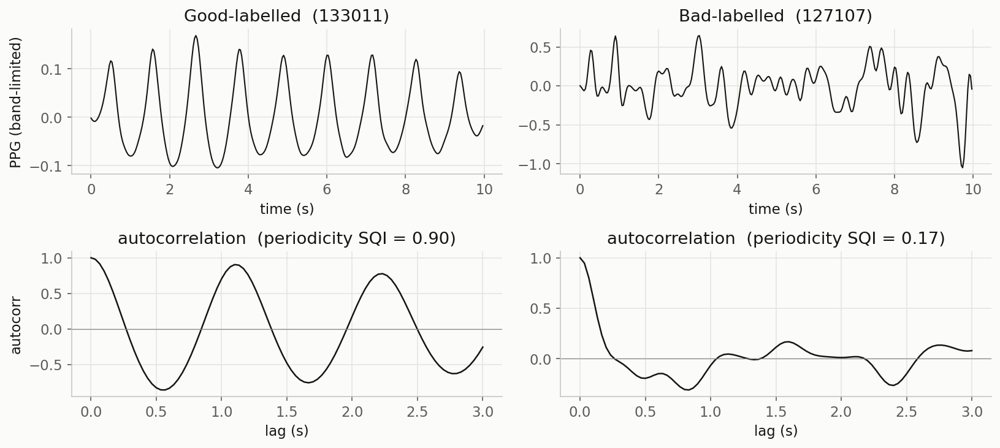

# Signal Quality Assessment for PPG, ECG, EMG, and EEG

**Is your physiological signal clean enough to use?** Before you extract a heart rate, detect a gesture, or score a sleep stage, you need to know whether the recording is any good. This project computes one cheap, literature-grounded quality metric per signal and checks it against ground truth where one exists. It scores signals; it never cleans them.

> 📝 **Full blog post:** [Is your PPG, ECG, EMG, or EEG signal clean enough to use?](https://signalsyntax.no/blog/is-this-signal-clean-enough/)

---

## Results

One metric per signal, tested on real data with a built-in answer key where available:

| Signal | Metric | Dataset | Result |
|---|---|---|---|
| **ECG** | kurtosis | MIT-BIH NSTDB | tracks the known noise schedule almost perfectly (~4-5 clean, <1 noisy) |
| **EMG** | SNR | Ninapro DB2 | every gesture clears the resting baseline; rest-vs-rest sits at ~0 dB |
| **EEG** | amplitude + kurtosis | Sleep-EDF | the two thresholds flag different artifact families |
| **PPG** | periodicity | BUT PPG | separates good from bad, but modestly (median 0.45 vs 0.30) |

ECG kurtosis is the cleanest result: computed over 30-second windows, it collapses on exactly the periods where noise was added.


PPG is the cautionary one. The textbook metric (skewness) needs the fine pulse morphology of high-rate contact PPG and fails on 30 Hz smartphone data, so a periodicity check ("does the pulse repeat?") is used instead: a clean pulse rings its autocorrelation, a noisy one does not.



---

## The four metrics

- **ECG → kurtosis.** Clean ECG is a flat baseline with tall QRS spikes (heavy-tailed, high kurtosis); noise pushes the distribution toward Gaussian and drops it.
- **PPG → periodicity.** BUT PPG's labels mean HR-detectability, so score whether the pulse repeats, via the peak of its autocorrelation.
- **EMG → SNR.** No single EMG index exists; compare RMS during a gesture to RMS at rest. This is a responsiveness check, using the `restimulus` activity labels.
- **EEG → amplitude + kurtosis.** Scalp EEG lives in tens of µV; flag segments near ±150 µV, and pair with kurtosis to catch brief spikes the amplitude bound misses.

Every threshold is a **heuristic that drifts** across devices, subjects, and sampling rates, not a universal constant.

## Repository contents

```
.
├── signal_quality.ipynb   # The four quality checks, end to end
├── requirements.txt
├── images/                # Figures used in this README
└── README.md
```

## Getting the data

Three datasets are files you download once; the EEG data is fetched automatically in code. Put the downloads under a `data/` folder next to the notebook:

- **PPG** &mdash; [BUT PPG database](https://physionet.org/content/butppg/2.0.0/) (PhysioNet) &rarr; `data/ppg/`
- **ECG** &mdash; [MIT-BIH Noise Stress Test Database](https://physionet.org/content/nstdb/1.0.0/) (PhysioNet) &rarr; `data/ecg/`
- **EMG** &mdash; [Ninapro DB2](https://ninapro.hevs.ch/instructions/DB2.html), subject 1 (`S1_E1_A1.mat`) &rarr; `data/emg/`
- **EEG** &mdash; no download: the code pulls a night of [Sleep-EDF](https://physionet.org/content/sleep-edfx/) through `mne.datasets`.

Expected layout:

```
data/
  ppg/  100001/100001_PPG.dat, ...  quality-hr-ann.csv
  ecg/  118e06.dat, 118e06.hea, 118e06.atr, ...
  emg/  S1_E1_A1.mat
```

The datasets carry their own licenses (BUT PPG and NSTDB are on PhysioNet; Ninapro has its own terms) and are not redistributed here.

## Running it

```bash
python -m venv .venv
source .venv/bin/activate        # Windows: .venv\Scripts\activate
pip install -r requirements.txt
jupyter notebook signal_quality.ipynb
```

Then Restart Kernel & Run All. Tested on Python 3.9.

## License

MIT — see [LICENSE](./LICENSE). The datasets it loads are governed by their own upstream licenses.
