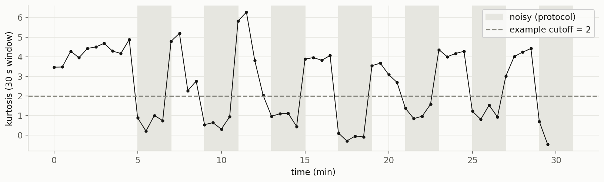

# Signal Quality Assessment for PPG, ECG, EMG, and EEG

Before you extract a heart rate, detect a gesture, or score a sleep stage, you
need to know whether the underlying signal is any good. This notebook is a short,
practical tour of **signal-quality assessment**: computing a cheap, literature
-recommended metric per signal and checking whether a recording is clean enough
to trust. It never filters or cleans the signals, it only scores them.

Companion to the blog post
[*Is This Signal Clean Enough to Use?*](https://signalsyntax.no/blog/is-this-signal-clean-enough/).



*ECG kurtosis computed over 30-second windows. Shaded blocks are the dataset's
known noisy periods; the metric collapses in almost every one.*

## The four checks

| Signal | Metric | Idea |
|---|---|---|
| **PPG** | periodicity (autocorrelation) | a clean pulse repeats at a steady beat interval |
| **ECG** | kurtosis | tall, narrow QRS spikes give heavy tails (Zhao & Zhang 2018) |
| **EMG** | SNR | gesture amplitude vs. resting baseline (field standard) |
| **EEG** | amplitude threshold + kurtosis | flat clinical bounds (~&pm;150 &micro;V) |

Each section loads a real recording, plots a clean segment next to a messy one,
computes the metric, and checks it against ground truth where it exists (expert
labels for PPG, a known noise schedule for ECG). The thresholds shown are
**heuristics that drift** across devices, subjects, and sampling rates, not
universal constants.

## Getting the data

Three datasets are files you download once; the EEG data is fetched
automatically in code. Put the downloads under a `data/` folder next to the
notebook:

- **PPG** &mdash; [BUT PPG database](https://physionet.org/content/butppg/2.0.0/) (PhysioNet) &rarr; `data/ppg/`
- **ECG** &mdash; [MIT-BIH Noise Stress Test Database](https://physionet.org/content/nstdb/1.0.0/) (PhysioNet) &rarr; `data/ecg/`
- **EMG** &mdash; [Ninapro DB2](https://ninapro.hevs.ch/instructions/DB2.html), subject 1 (`S1_E1_A1.mat`) &rarr; `data/emg/`
- **EEG** &mdash; no download: the code pulls a night of [Sleep-EDF](https://physionet.org/content/sleep-edfx/) through `mne.datasets`.

Expected layout:

```
data/
  ppg/  100001/100001_PPG.dat, ...  quality-hr-ann.csv
  ecg/  118e06.dat, 118e06.hea, 118e06.atr, ...
  emg/  S1_E1_A1.mat
```

The datasets carry their own licenses (BUT PPG and NSTDB are on PhysioNet;
Ninapro has its own terms). They are not redistributed here.

## Running it

```bash
python -m venv .venv
source .venv/bin/activate        # Windows: .venv\Scripts\activate
pip install -r requirements.txt
jupyter notebook signal_quality.ipynb
```

Then Restart Kernel & Run All. Tested on Python 3.9.

## License

Code in this repository is released under the [MIT License](LICENSE). The
datasets it loads are governed by their own upstream licenses.
